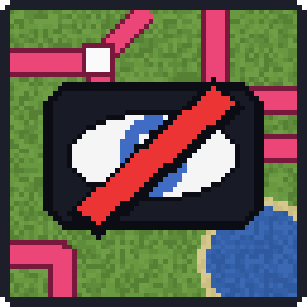

<p align="center">
  
</p>

<h1 align="center">Hide Train Map</h1>

<p align="center">
  Hides Create's train map on Xaero's World Map and stops the server from sending train positions.<br>
  NeoForge 1.21.1 · Create 6.0.x · Required on client and server
</p>

---

**Hide Train Map** removes Create's built-in *train map* overlay from Xaero's World Map, for multiplayer servers where the rail network of other players should stay secret.

With this mod installed, players no longer see on their maps:
- the pink/red lines of every train track in the world,
- the trains and their positions, owners and destinations,
- the stations,
- the button that turns the overlay on and off.

Rails stay visible as normal blocks on the map, exactly like any other block you have explored.

## How it works

- **Client:** Create's Xaero World Map integration is turned into a no-op. Nothing is drawn, nothing is requested from the server, and the toggle button can no longer be hovered or clicked. Editing `create-client.toml` does not bring it back.
- **Server:** the server ignores train map requests, so it never sends train positions to anyone, even to a client that asks for them.
- **Required on both sides:** a client without the mod cannot join a server that has it.

## Protection against bypasses

At launch, the game refuses to start (with a clear error message) if a mod that can show Create trains or tracks on a map is installed:

- JourneyMap and FTB Chunks (Create draws its own train map on them)
- Xaero Train Map
- Create Track Map
- Create - Xaero's map / Sable Sublevels on Xaero's Maps (draws Create contraptions, including trains, on Xaero's maps)
- Antique Atlas: Create Train Networks
- any other map addon that reads Create's rail network

If a Create update ever changes the code this mod patches, the game also refuses to start, instead of silently showing the train map again.

## What is not affected

Everything else in Create works as usual: building and driving trains, schedules, stations, signals (including signal section colouring), track placement, and train addons. Create's rail network sync is not touched.

Performance: the mod only removes work (no map overlay rendering, no train position packets).

## Compatibility

| | Version |
|---|---|
| Minecraft | 1.21.1 |
| NeoForge | 21.1.x |
| Create | 6.0.x (tested with 6.0.10) |
| Xaero's World Map / Minimap | optional |

## Limits

This mod is meant for normal players on unmodified launchers. It is not an anti-cheat: a deliberately modified client can always read data the server sends (such as the rail network itself, which Create syncs to every client).

## For modpack makers

Put the same jar in the server and in the client pack. Remove the mods listed above first, or the game will refuse to start.

## Building

```bash
./gradlew build
```

The jar is written to `build/libs/`. Requires Java 21.

## License

[MIT](LICENSE)
